# 高専生活サポートアプリ

- アプリサイト: [https://www.kosen-management.jp](https://www.kosen-management.jp)
- 制作時間: 30時間30分

課題・時間割・連絡・テスト情報をまとめて管理する Next.js アプリです。生徒はダッシュボードで日々の情報を確認でき、管理者はユーザー・教科・課題・テスト・連絡を一元的に運用できます。

この README は、評価時に最初に読まれることを意識して、実装済みの機能とセキュリティ設計を先にまとめています。

## まず見てほしいポイント

- 生徒向けダッシュボードで、課題の完了チェック、締切の残り日数、時間割、未読連絡、テスト予定を確認できます。
- 管理者は、ユーザー管理、教科登録、時間割、課題、テスト、日々の連絡をまとめて操作できます。
- 連絡文は Markdown 対応で、メール送信時には安全な HTML に変換されます。
- 出席番号を使って、登録後に設定したり、通知対象を絞り込んだりできます。
- 認証、Cookie、CSP、レート制限、cron secret など、セキュアな設計を重視しています。

## セキュリティ設計

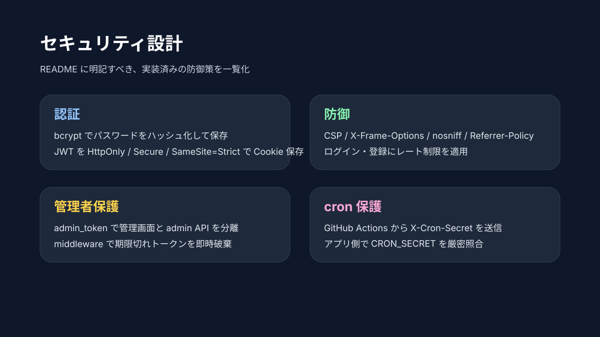

## アプリ画面

### ログイン
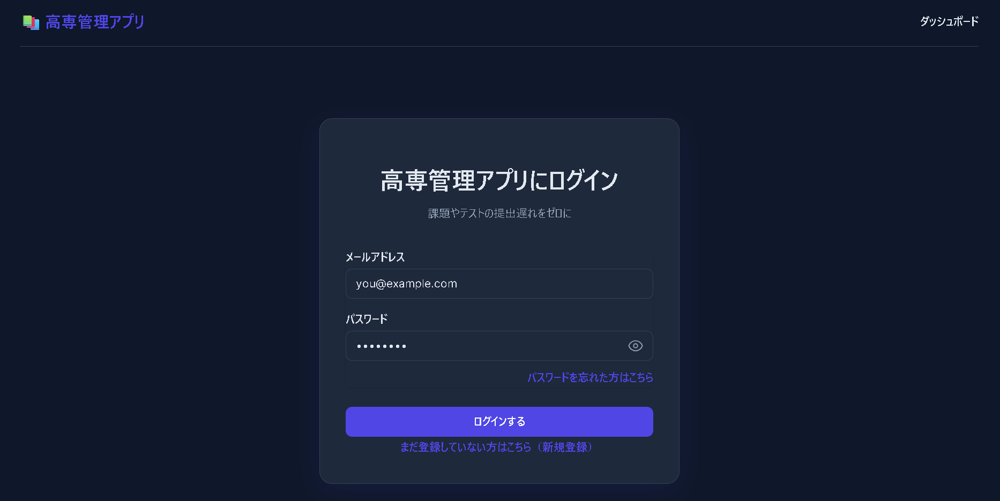

### 新規登録
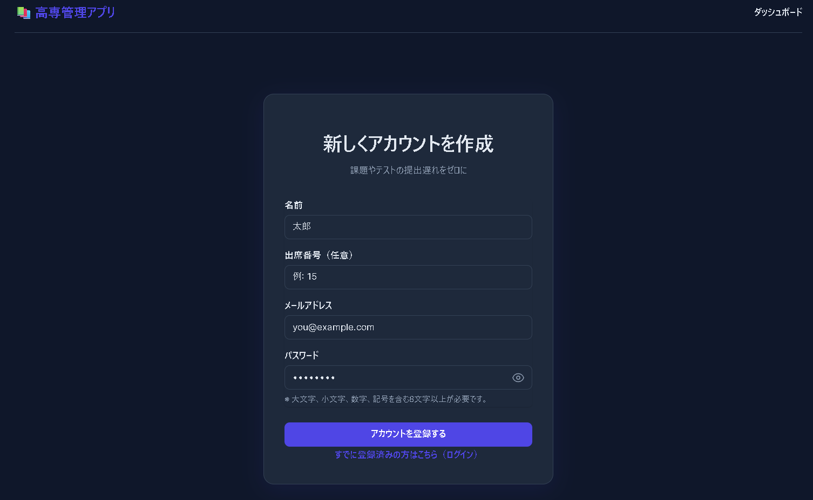

### パスワードを忘れたとき
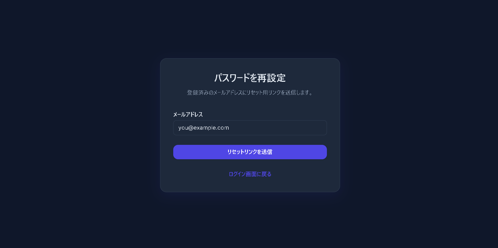

### ダッシュボード
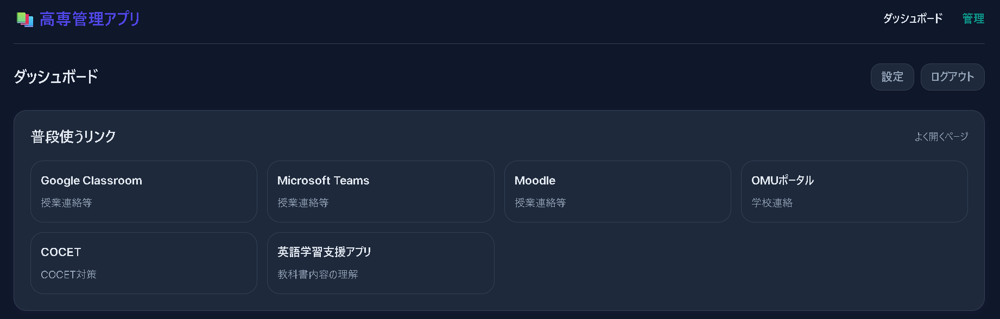
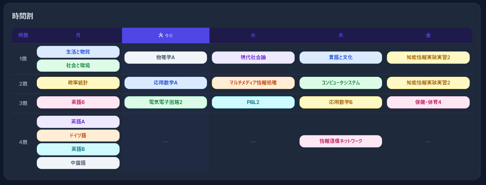
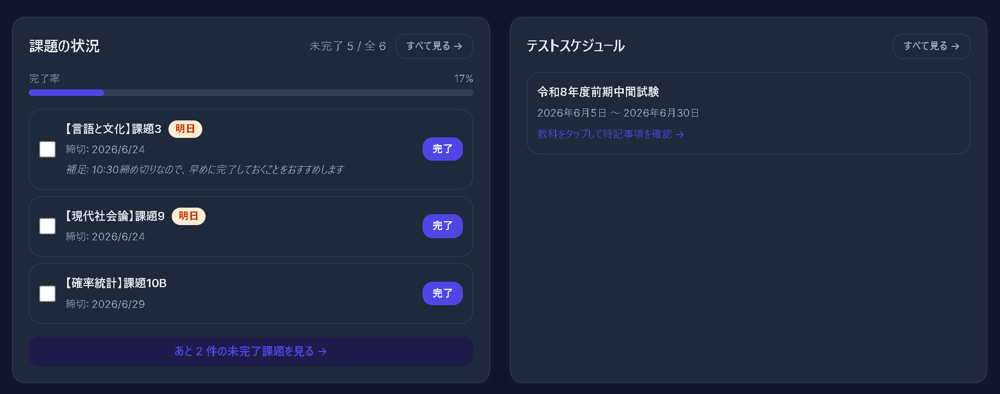
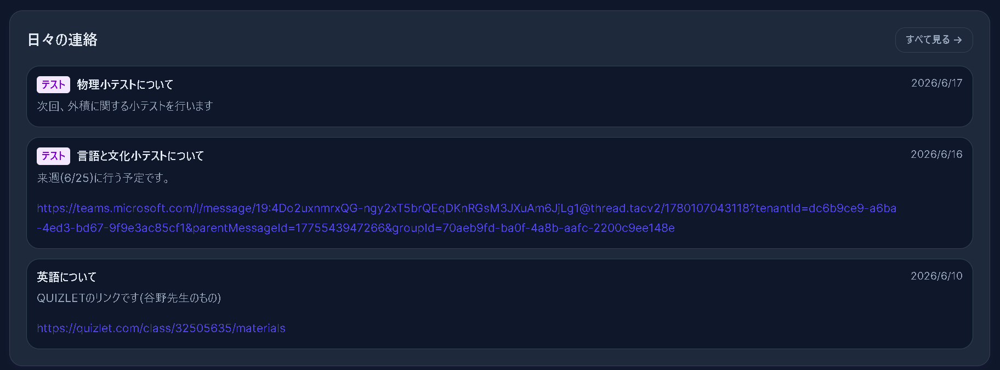

### 課題一覧
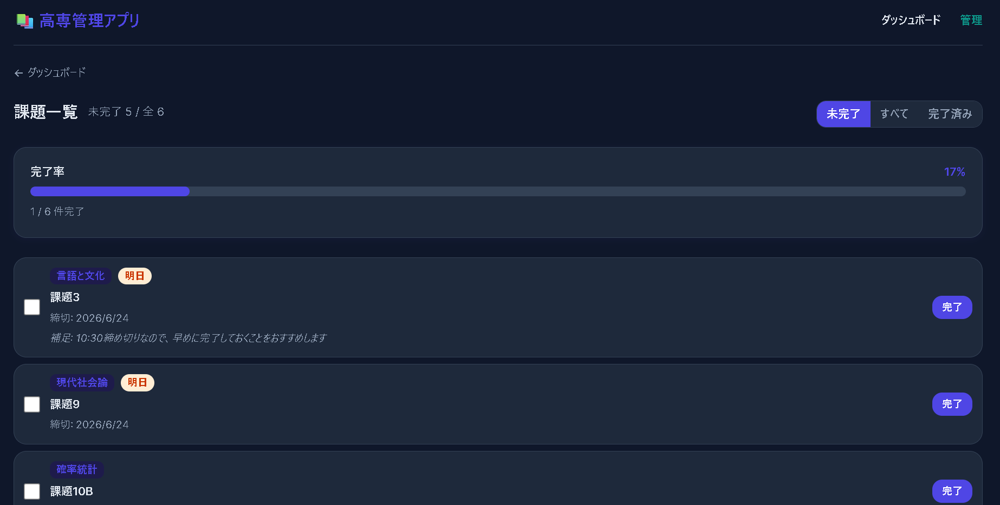

### テストスケジュール
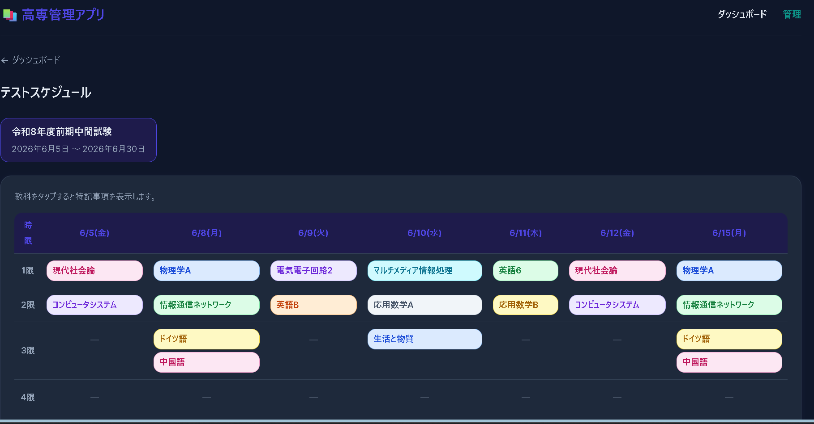

### 連絡一覧
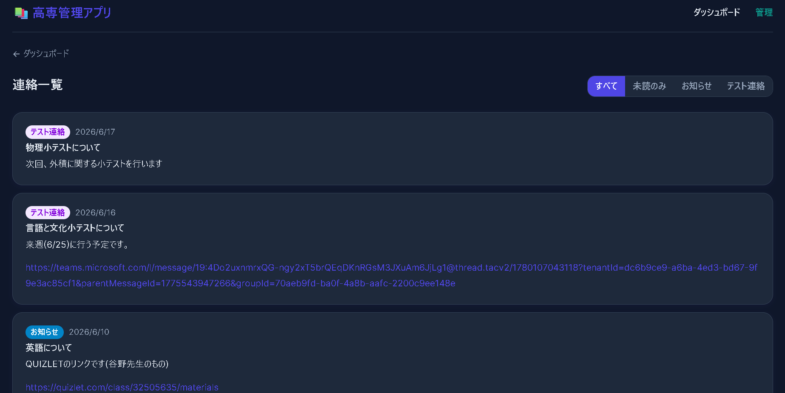

### 設定画面
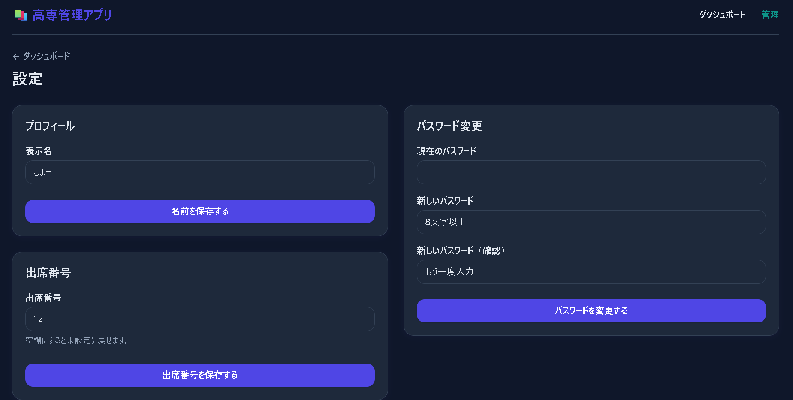

## 主な機能

### 生徒向け

- ログイン / 新規登録 / パスワード再設定
- 出席番号の登録
- ダッシュボードで直近の予定を一覧表示
  - 時間割
  - 期限が近い課題と完了状態の切り替え
  - 未読連絡の確認と既読化
  - 近いテストの予定
- 専用ページでの詳細確認
  - 課題一覧
  - テストスケジュール
  - 連絡一覧
- 設定画面で表示名と出席番号を後から変更可能

### 管理者向け

- ユーザー管理
  - 登録済みユーザーの一覧表示
  - 出席番号の後から編集
  - ユーザー削除
- 教科管理 (科目と担当者の登録)
- 授業 / 時間割管理
- 課題管理
  - 課題の登録と削除
  - 生徒への通知送信
- テスト管理
  - テスト日程、範囲、特記事項を登録
  - 特記事項は Markdown 対応
  - 出席番号範囲を指定した通知送信
- 日々の連絡
  - お知らせ登録
  - Markdown 対応の本文をメール送信
  - テスト連絡の送信にも対応
- 日々のリンク管理
  - リモート授業やオンライン資料へのリンク共有

### 通知の特徴

- 対象ユーザーを個別選択できます。
- 出席番号の From / To を指定して通知対象を絞れます。
- テスト連絡では特記事項を含めて通知できます。
- 課題の締切が近いユーザーには cron でリマインドを送れます。

## セキュリティ設計

このアプリは、なるべく「ガチガチに」安全側へ寄せています。

- パスワードは bcrypt でハッシュ化して保存しています。
- 認証トークンは HttpOnly Cookie に保存しています。
- Cookie は `secure`, `sameSite: 'strict'`, `path: '/'` を設定しています。
- JWT は `jose` で署名・検証しています。
- 管理画面は `admin_token` で保護しています。
- middleware でログイン期限切れトークンを検知し、Cookie を削除しています。
- Next.js の `next.config.ts` で以下のヘッダーを設定しています。
  - Content-Security-Policy
  - X-Frame-Options
  - X-Content-Type-Options
  - X-XSS-Protection
  - Referrer-Policy
  - Permissions-Policy
  - Strict-Transport-Security
- ログインと登録にはレート制限を入れています。
- 入力値は `src/lib/security.ts` のバリデーションで検証しています。
- マークダウン由来の HTML 文字列は、`dangerouslySetInnerHTML` で描画する前に `DOMPurify (isomorphic-dompurify)` によってサニタイズし、Stored XSS (蓄積型XSS) を防止しています。
- cron の task reminder は `CRON_SECRET` を使って保護しています。
- 管理者 API は認証済みの admin のみが触れる前提です。

## 技術スタック

- Next.js 16 (App Router)
- React 19
- TypeScript
- Prisma
- PostgreSQL
- Tailwind CSS v4
- bcrypt
- jose
- Resend
- Redis 対応のレート制限

## ディレクトリの見どころ

### 生徒向け画面 (`src/app/dashboard/*`, `src/app/auth/*`)
- `src/app/page.tsx` : ログイン
- `src/app/auth/register/page.tsx` : 新規登録
- `src/app/auth/forgot-password/page.tsx` : パスワード再設定
- `src/app/dashboard/page.tsx` : 生徒ダッシュボード
- `src/app/dashboard/tasks/page.tsx` : 課題一覧
- `src/app/dashboard/tests/page.tsx` : テストスケジュール
- `src/app/dashboard/announcements/page.tsx` : 連絡一覧
- `src/app/dashboard/settings/page.tsx` : 設定画面

### 管理者向け画面 (`src/app/admin/*`)
- `src/app/admin/page.tsx` : 管理メニュー
- `src/app/admin/users/page.tsx` : ユーザー管理
- `src/app/admin/subjects/page.tsx` : 教科管理
- `src/app/admin/lessons/page.tsx` : 授業/時間割管理
- `src/app/admin/tasks/page.tsx` : 課題管理
- `src/app/admin/tests/page.tsx` : テスト管理
- `src/app/admin/announcements/page.tsx` : 日々の連絡
- `src/app/admin/daily-links/page.tsx` : 日々のリンク

### API・バッチ処理 (`src/app/api/*`, `.github/workflows/*`)
- `src/app/api/auth/*` : 認証 API
- `src/app/api/admin/*` : 管理者 API
- `src/app/api/cron/task-reminder/route.ts` : 課題リマインド cron
- `src/app/api/cron/task-cleanup/route.ts` : 過去の課題クリーンアップ cron
- `src/app/api/cron/backup/route.ts` : データベースバックアップ cron
- `.github/workflows/task-cleanup.yml` : 課題クリーンアップの定期実行 (GitHub Actions)
- `.github/workflows/backup.yml` : データベースバックアップの定期実行 (GitHub Actions)

### 共通処理 (`src/lib/*`)
- `src/lib/email.ts` : メール送信処理
- `src/lib/markdown.ts` : Markdown → HTML 変換
- `src/lib/security.ts` : 入力検証とサニタイズ処理

## 開発方法

### 必要条件

- Node.js
- PostgreSQL

### インストール

```bash
npm install
```

### 開発サーバー

```bash
npm run dev
```

### 本番ビルド

```bash
npm run build
```

### Lint

```bash
npm run lint
```

## 環境変数

最低限、以下を設定してください。

```bash
DATABASE_URL="postgresql://..."
JWT_SECRET="your_jwt_secret_here"
ADMIN_EMAIL="admin@example.com"
ADMIN_PASSWORD="change-me"
RESEND_API_KEY=""
FROM_EMAIL="onboarding@example.com"
APP_URL="http://localhost:3000"
CRON_SECRET="your_shared_cron_secret"
```

## 実装メモ

- 出席番号は新規登録時に入力でき、あとから設定画面でも変更できます。
- 管理者は、必要に応じてユーザーごとの出席番号を調整できます。
- 課題・テスト・連絡の送信は、個別選択または出席番号範囲で絞り込めます。
- お知らせ本文は Markdown に対応しており、メールでは安全な HTML として配信されます。

## 確認済み

- `npm run build` でビルド確認済み

## ライセンス

必要に応じて追記してください。
